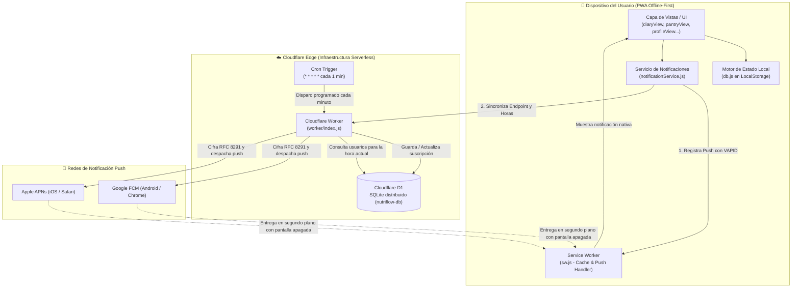

# 🏛️ NutriFlow — Arquitectura del Sistema

Este documento describe la arquitectura técnica, las decisiones de diseño, el flujo de datos y la infraestructura serverless que sustentan a **NutriFlow**.

---

## 1. Visión General y Filosofía de Diseño

NutriFlow está diseñada siguiendo tres pilares arquitectónicos clave:

1. **Offline-First / Local-First:** Los datos del usuario (registros de comida, catálogo de recetas, inventario de despensa y preferencias) residen primariamente en el cliente. La aplicación es 100% funcional sin conexión a internet y no depende de un servidor central para sus operaciones esenciales.
2. **Zero-Build Vanilla Stack:** Todo el frontend está escrito en JavaScript estándar moderno (ES6+ modular), HTML5 semántico y CSS3 nativo. No requiere empaquetadores (`webpack`, `vite`) ni dependencias en tiempo de ejecución, lo que garantiza tiempos de carga instantáneos (0 ms de overhead de frameworks) y compatibilidad a largo plazo.
3. **Edge-Driven Background Notifications:** Para resolver la limitación de que los navegadores móviles detienen los temporizadores de JavaScript cuando la pantalla se bloquea, NutriFlow implementa un motor serverless en el edge (Cloudflare Workers + Cloudflare D1) que entrega alertas nativas mediante el estándar internacional W3C Web Push (RFC 8291).

---

## 2. Diagrama de Arquitectura Global



---

## 3. Capas del Sistema

### 3.1. Capa de Presentación (Frontend Modular)
* **Single Page Application (SPA):** Gestionada sin frameworks mediante navegación por contenedores (`screen-diary`, `screen-pantry`, `screen-recipes`, `screen-profile`, `screen-dashboard`).
* **Vistas desacopladas (`js/views/`):**
  * `diaryView.js`: Renderizado del diario diario, barra de macros, cálculo de calorías consumidas vs objetivo y timeline de comidas.
  * `pantryView.js`: Inventario reactivo de ingredientes con soporte para sumar/restar stock y cálculo de recetas cocinables.
  * `shoppingView.js`: Generación de listas de compras automáticas basadas en ingredientes faltantes.
  * `recipesView.js`: Catálogo de recetas con filtrado y vista detallada de ingredientes y preparación.
  * `profileView.js`: Configuración de metas de macronutrientes, lista de exclusión de ingredientes (*dislikes*), horarios de comida y sincronización de notificaciones.
* **Componentes UI reutilizables (`js/components/`):** Hojas modales deslizables (*action sheets*), modal de dictado por voz y editor de recetas.

### 3.2. Capa de Servicios de Negocio (`js/services/`)
* **`db.js`:** Capa de abstracción de almacenamiento sobre `localStorage`. Implementa versionado de esquema, migración automática de datos, inicialización con catálogo base y métodos de consulta/escritura reactivos (`getTodayLogs()`, `saveLog()`, `updatePreferences()`).
* **`calc.js`:** Motor de cálculo nutricional. Totaliza macronutrientes (proteínas, carbohidratos, grasas y calorías) a partir de gramos y proporciones según la base de datos de alimentos.
* **`ai.js`:** Cliente de IA conectado con la API de Google Gemini para análisis de comidas, desglose de ingredientes y asesoría nutricional.
* **`notificationService.js`:** Coordinador híbrido de recordatorios. Mantiene el temporizador local en primer plano (`setInterval`) y gestiona la suscripción y sincronización Web Push con el Cloudflare Worker.

### 3.3. Capa de Service Worker (`sw.js`)
* **Ciclo de vida:** `skipWaiting()` y `clients.claim()` para activación inmediata.
* **Manejador Offline:** Intercepta eventos `fetch` proveyendo fallback sin conexión para la PWA.
* **Manejador de Eventos Push:**
  ```javascript
  self.addEventListener('push', (event) => {
    // Despierta en segundo plano, extrae el payload JSON y lanza showNotification()
  });
  ```
* **Manejador de Clics:** `notificationclick` enfoca la ventana existente de NutriFlow o abre una nueva instancia en la pantalla relevante.

---

## 4. Motor de Notificaciones Web Push (Edge Serverless)

### 4.1. Por qué esta arquitectura
Los sistemas operativos móviles modernos (Android y especialmente iOS) congelan los procesos de JavaScript en pestañas inactivas para ahorrar batería. Para garantizar que un recordatorio de comida suene puntualmente a las `13:30` con el teléfono en el bolsillo, es obligatorio utilizar **Web Push**.

### 4.2. Criptografía Pura con Web Crypto API (RFC 8291 + RFC 8292)
A diferencia de arquitecturas tradicionales que requieren paquetes pesados de Node.js como `web-push`, el Worker de NutriFlow implementa el estándar completo utilizando la API nativa `crypto.subtle`:
* **Intercambio de claves efímeras ECDH:** Curva elíptica P-256 (`prime256v1`).
* **Derivación de claves HKDF:** Derivación de clave de cifrado (CEK de 16 bytes) y Nonce (12 bytes) a partir del secreto compartido y el secreto de autenticación (`auth`) del suscriptor.
* **Cifrado autenticado AES-GCM:** Generación de payload con codificación `aes128gcm` y delimitador de registro `0x02`.
* **Firmas VAPID ES256:** Creación y firma criptográfica de JWTs mediante clave privada P-256 para autenticación frente a los servidores de Google FCM y Apple APNs.

### 4.3. Esquema de Base de Datos Cloudflare D1 (SQLite)
La tabla `subscriptions` almacena las credenciales de push y las preferencias horarias de cada dispositivo:

```sql
CREATE TABLE IF NOT EXISTS subscriptions (
  id TEXT PRIMARY KEY,
  endpoint TEXT UNIQUE NOT NULL,
  p256dh TEXT NOT NULL,
  auth TEXT NOT NULL,
  timezone TEXT NOT NULL DEFAULT 'America/Lima',
  reminders_json TEXT NOT NULL,
  last_notified_json TEXT DEFAULT '{}',
  created_at DATETIME DEFAULT CURRENT_TIMESTAMP,
  updated_at DATETIME DEFAULT CURRENT_TIMESTAMP
);
CREATE INDEX IF NOT EXISTS idx_endpoint ON subscriptions(endpoint);
```

### 4.4. Ciclo del Cron Trigger
1. **Despertar cada minuto:** El Cron Trigger `* * * * *` invoca el handler `scheduled(event, env, ctx)` del Worker.
2. **Evaluación de zona horaria:** Para cada suscriptor en D1, calcula la hora local exacta (`HH:MM`) según su `timezone` (ej. `America/Lima`).
3. **Verificación de duplicidad:** Consulta `last_notified_json` para asegurar que cada comida solo se notifique **una única vez al día**.
4. **Rotación probabilística de copy:** Selecciona la variante del mensaje según los pesos de marca (70% minimalista, 20% cálida, 10% divertida).
5. **Auto-limpieza de suscripciones:** Si el servidor de Google o Apple responde con código `404 Not Found` o `410 Gone` (el usuario desinstaló la PWA o revocó el permiso), la fila se elimina automáticamente de D1.


---

## 5. Seguridad y Privacidad

1. **Sin venta ni rastreo de datos:** Los datos de comidas, peso y hábitos nunca salen del dispositivo del usuario hacia servidores de terceros.
2. **Cifrado de extremo a extremo en Web Push:** El contenido de las notificaciones viaja completamente cifrado con claves únicas generadas en el dispositivo (`p256dh` + `auth`). Ni Cloudflare ni los servidores intermediarios de Google/Apple pueden leer el texto plano del recordatorio antes de que llegue al teléfono.
3. **Control total de API Keys:** La clave de Google Gemini se almacena exclusivamente en el almacenamiento local del navegador y solo viaja directamente a los endpoints oficiales de Google AI Studio.
